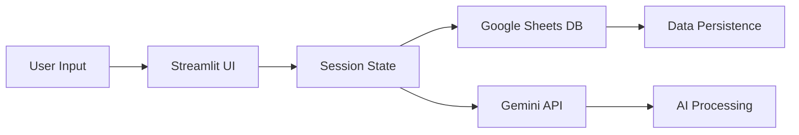

# Marketing Automation Tools - Project Visualization Report

## 📊 Project Statistics
     164 total files
     114 Python files
     806 JavaScript files
      36 Markdown files

## 📁 Directory Structure


## 🏗️ Main Components

### Core Directories:
api/
automation/
components/
config/
dashboard/
data/
docs/
node_modules/
outputs/
page_modules/

## 📈 Largest Python Files:
./pages/_attribution_analysis.py: 2138 lines
./pages/_customer_journey_engine.py: 2054 lines
./pages/_multi_platform_manager.py: 1828 lines
./dashboard/pages/attribution_analysis.py: 1808 lines
./dashboard/pages/customer_journey_engine.py: 1667 lines
./pages/_pricing_strategy.py: 1633 lines
./dashboard/pages/multi_platform_manager.py: 1493 lines
./pages/_realtime_ad_optimizer.py: 1408 lines
./dashboard/pages/realtime_ad_optimizer.py: 1241 lines
./pages/_new_product.py: 1182 lines

## 🔗 Dependencies (from requirements.txt):
streamlit>=1.32.0
pandas>=2.2.0
numpy>=1.26.0
plotly>=5.19.0
matplotlib>=3.8.0
seaborn>=0.13.0
google-generativeai==0.8.5
scipy>=1.11.0
scikit-learn>=1.3.0
requests==2.31.0
aiohttp==3.9.3
urllib3==2.2.0
certifi==2024.2.2


## 🌳 Project Structure Visualization

```
marketing-automation-tools/
├── 📱 app.py (Main Entry Point)
├── 📦 requirements.txt (43 dependencies)
├── 🐳 Dockerfile & deploy scripts
├── 📁 pages/ (30 feature pages)
│   ├── _new_product.py (1,182 lines)
│   ├── _realtime_chat.py
│   ├── _sheets_settings.py
│   └── ... (27 more pages)
├── 📁 components/ (7 reusable UI components)
│   ├── common_sidebar.py
│   ├── project_card.py
│   └── ... (5 more)
├── 📁 utils/ (4 utility modules)
│   ├── session_state.py
│   ├── google_sheets_db.py
│   └── ... (2 more)
├── 📁 config/ (AI and app configuration)
├── 📁 styles/ (common styling)
└── 📁 docs/ (documentation)
```

## 🔄 Data Flow Architecture



## 📊 Component Dependencies

- **app.py** ← utils/*, components/*
- **pages/** ← utils/session_state, google_sheets_db
- **components/** ← styles/common
- **AI features** ← config/ai_models → Gemini API

## 🚀 External Integrations

1. **Google Sheets API** - Data persistence
2. **Gemini API** - AI processing
3. **Gemini Gems** - Specialized AI tools
4. **Cloud Run** - Deployment platform

## 📈 Project Scale

- **Total Files**: 164
- **Python Files**: 114
- **JavaScript Files**: 806 (includes node_modules)
- **Total Python Code**: ~20,000+ lines
- **Feature Pages**: 30
- **Reusable Components**: 7


